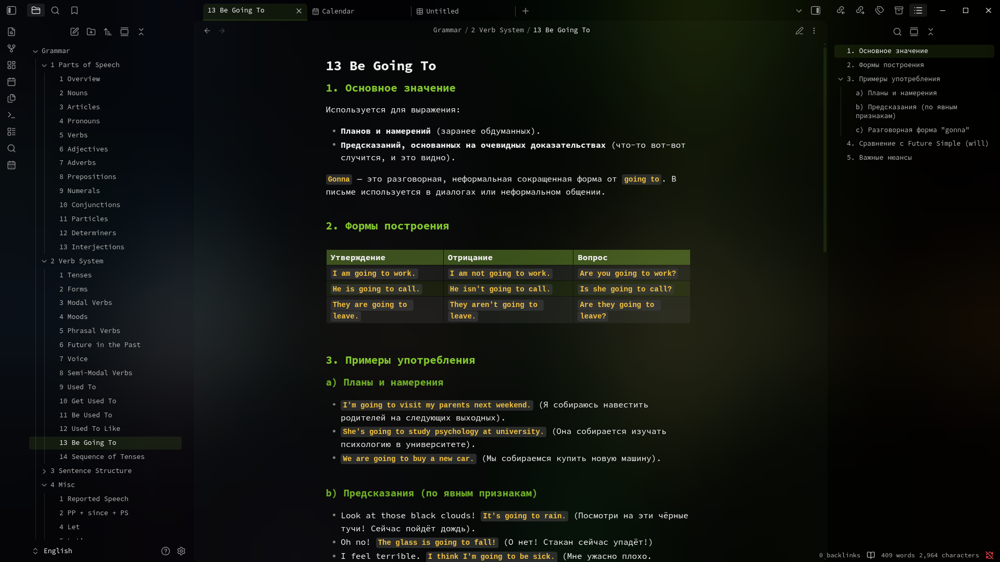
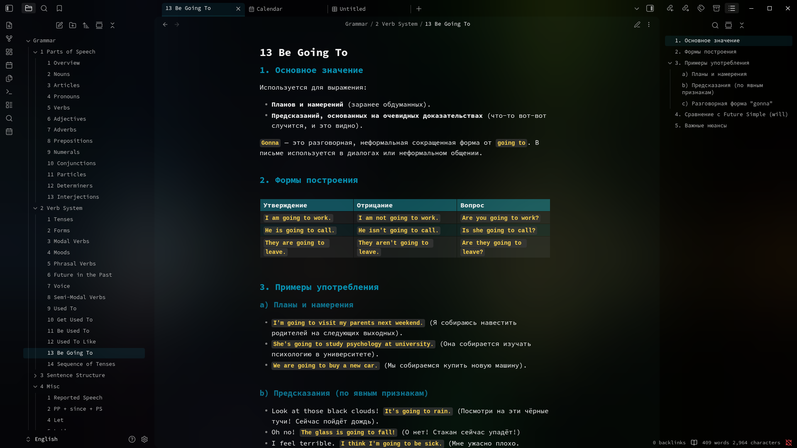
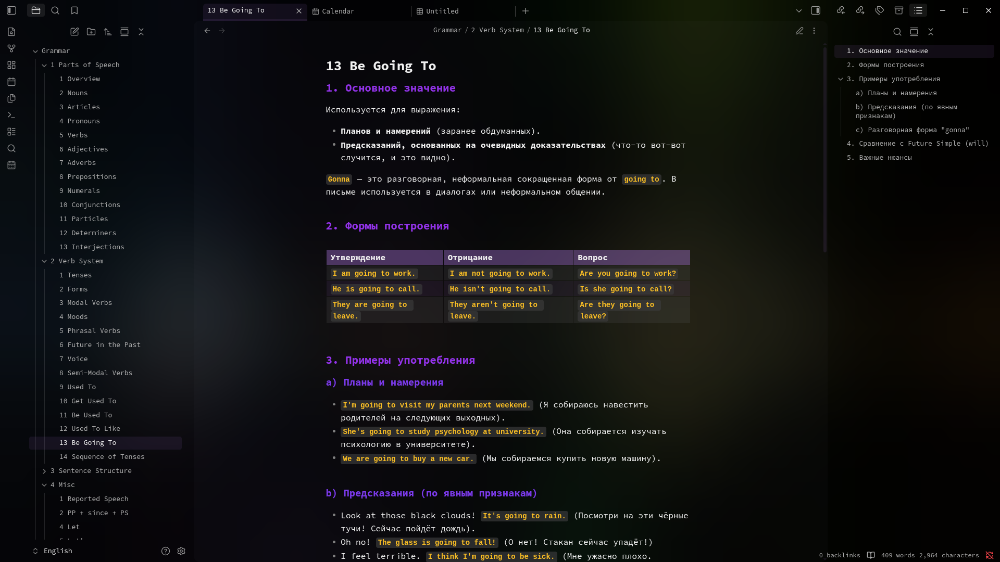
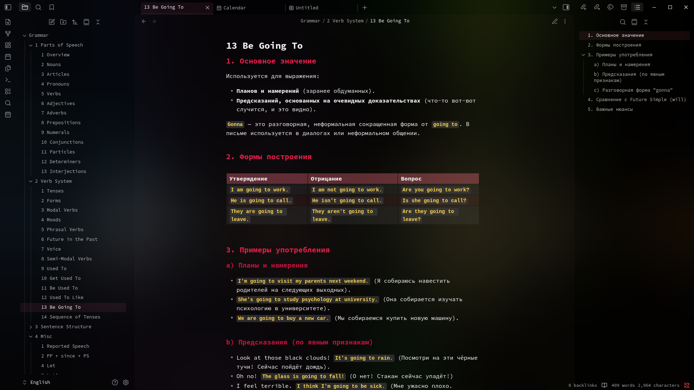
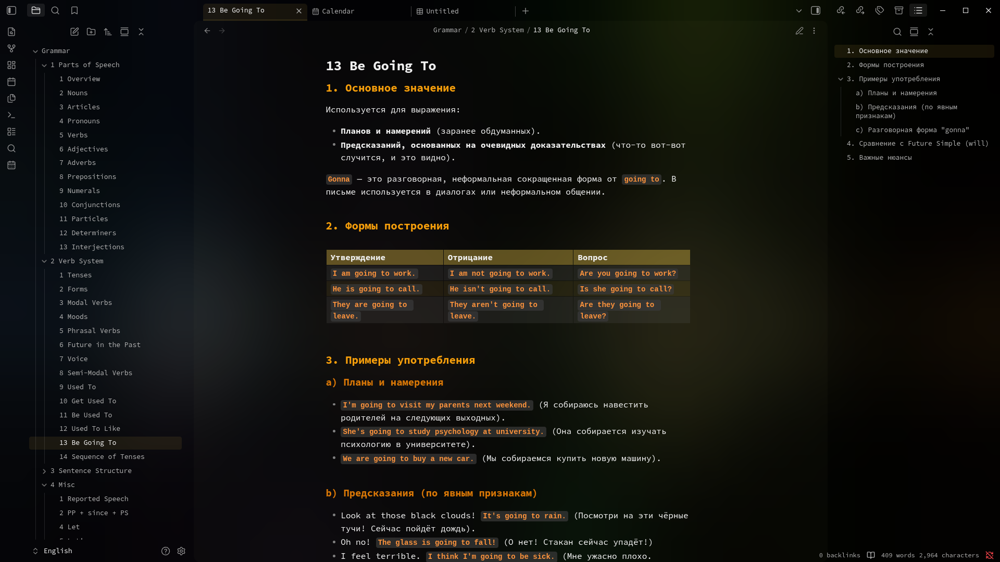

# Exotic Themes for Obsidian

A collection of minimalist themes for [Obsidian](https://obsidian.md) featuring a frosted glass effect and carefully curated color palettes.


## ✨ Features

- **Frosted glass effect** — backdrop-filter with blur and dimming
- **5 color palettes** — choose your favorite
- **Gradient headers** — H1-H6 with smooth color transitions
- **Monospace font** — Source Code Pro throughout the interface
- **Minimalist design** — transparent backgrounds, subtle borders
- **Styled tables** — with row highlighting on hover

## 🎨 Palettes

| Theme | Primary Color | Description |
|-------|---------------|-------------|
| **Exotic (Lime)** | `#aef93e` | Classic green, the original theme |
| **Exotic (Cyan)** | `#22d3ee` | Cool turquoise |
| **Exotic (Purple)** | `#c084fc` | Creative violet |
| **Exotic (Rose)** | `#fb7185` | Vibrant pink-red |
| **Exotic (Gold)** | `#fcd34d` | Elegant golden |

## 📦 Installation

1. Download the desired theme folder (e.g., `Exotic (Lime)`)
2. Open Obsidian → Settings → Appearance
3. Click the folder icon next to "Themes"
4. Copy the downloaded folder into the opened directory
5. Select the theme in Obsidian settings

## 🖼️ Using with Background Images

For the best glass effect, use the theme with a background image. Add this to your CSS snippet:

```css
.horizontal-main-container {
    background-image: url("image_base64");
    background-size: cover;
    background-position: center;
}
```

or 

```css
.horizontal-main-container {
    background-color: #ffffff;
}
```

Or use the **Custom Background** plugin for easy background management.

## ⚙️ Customization

All colors are defined via CSS variables in `:root`. Key variables:

```css
:root {
    /* Primary color */
    --color-primary: #aef93e;
    
    /* Glass effects */
    --brightness: 0.4;
    --blur: 100px;
    
    /* Headers */
    --color-header1: #aef93e;
    --color-header2: #99e035;
    /* ... */
}
```

## 🔧 Requirements

- Obsidian v1.11.5 or newer
- Recommended: Install [Source Code Pro](https://fonts.google.com/specimen/Source+Code+Pro) font

## 📸 Screenshots

<details>
<summary>Exotic (Lime)</summary>


</details>

<details>
<summary>Exotic (Cyan)</summary>


</details>

<details>
<summary>Exotic (Purple)</summary>


</details>

<details>
<summary>Exotic (Rose)</summary>


</details>

<details>
<summary>Exotic (Gold)</summary>


</details>
